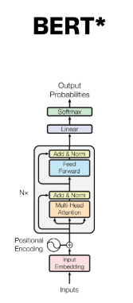
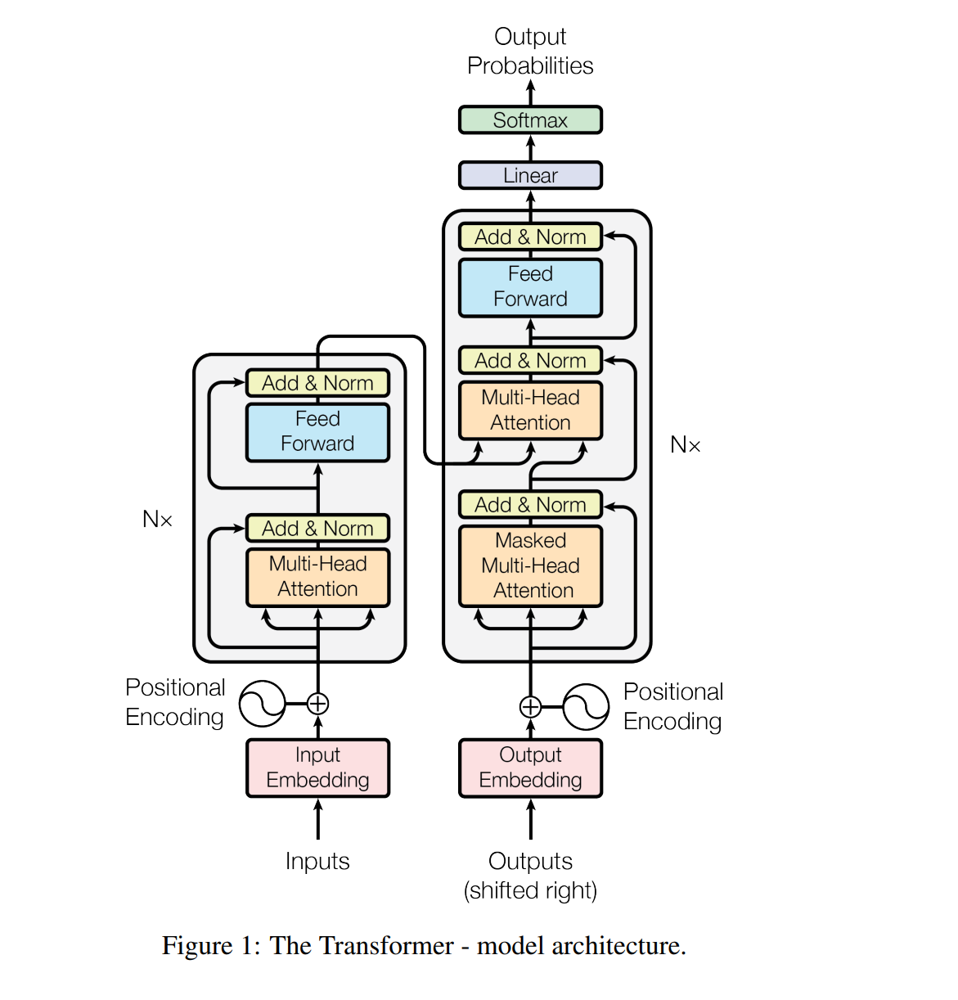
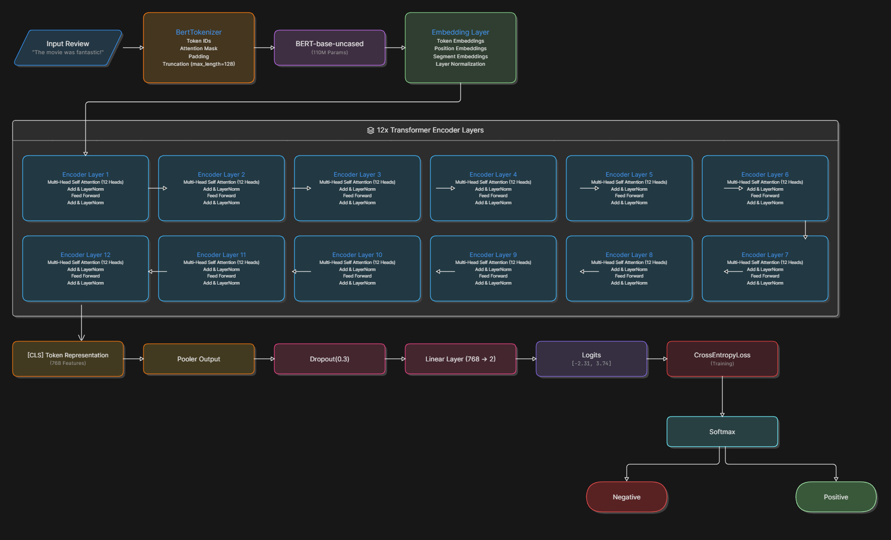

# BERT-Based Sentiment Analysis using PyTorch and Hugging Face Transformers

<p align="center">
  
</p>

This project performs **binary sentiment classification** on the **IMDB Movie Review Dataset** using a fine-tuned **BERT-base-uncased** model implemented with **PyTorch** and **Hugging Face Transformers**.

---

# Table of Contents

- [Transformer Architecture](#transformer-architecture)
- [Bidirectional Encoder Representations from Transformers (BERT)](#bidirectional-encoder-representations-from-transformers-bert)
- [IMDB Dataset](#imdb-dataset)
- [Fine-Tuning Process](#fine-tuning-process)
- [Model Architecture](#model-architecture)
- [Training Pipeline](#training-pipeline)
- [Results](#results)
- [Project Structure](#project-structure)
- [Technologies Used](#technologies-used)
- [Future Improvements](#future-improvements)

---

# Transformer Architecture

The Transformer architecture, introduced in the paper **"Attention Is All You Need" (2017)**, replaced recurrent neural networks with self-attention mechanisms.

Unlike RNNs and LSTMs, Transformers process tokens in parallel, allowing:

- Faster training
- Better contextual understanding
- Long-range dependency learning
- Improved representation learning

A Transformer consists of:

- Input Embeddings
- Positional Encoding
- Multi-Head Self-Attention
- Feed Forward Networks
- Residual Connections
- Layer Normalization

Self-attention enables each token to attend to every other token in the sequence, capturing relationships among words regardless of their distance.

---

## Transformer Architecture Diagram

<p align="center">
  
</p>

---

# Bidirectional Encoder Representations from Transformers (BERT)

BERT (**Bidirectional Encoder Representations from Transformers**) is an **encoder-only Transformer model** developed by Google.

Unlike traditional language models that read text from left to right, BERT processes text **bidirectionally**, considering both previous and future context simultaneously.

For example:

> "The movie was surprisingly good."

The word **good** is understood using information from all surrounding words.

---

## BERT-base-uncased Specifications

| Parameter | Value |
|------------|-------|
| Encoder Layers | 12 |
| Attention Heads | 12 |
| Hidden Size | 768 |
| Feed Forward Dimension | 3072 |
| Parameters | ~110 Million |

---

## BERT Architecture

<p align="center">
  
</p>

---

## BERT Pretraining Tasks

### 1. Masked Language Modeling (MLM)

Random words are masked, and BERT learns to predict them using both left and right context.

Example:

Input:

```
The movie was [MASK].
```

Prediction:

```
fantastic
```

---

### 2. Next Sentence Prediction (NSP)

BERT learns relationships between sentence pairs, improving sentence-level understanding.

Through pretraining, BERT acquires rich semantic and linguistic knowledge that can later be transferred to downstream tasks through fine-tuning.

---

# IMDB Dataset

The IMDB Movie Review Dataset is one of the most widely used benchmarks for sentiment analysis.

## Dataset Statistics

| Property | Value |
|-----------|------|
| Total Reviews | 50,000 |
| Positive Reviews | 25,000 |
| Negative Reviews | 25,000 |
| Task | Binary Classification |

Labels:

- Positive
- Negative

The dataset contains reviews of varying lengths and complexity, making it ideal for evaluating contextual language models like BERT.

The data is split into:

- Training Set (80%)
- Validation Set (20%)

using:

```python
train_test_split()
```

---

# Fine-Tuning Process

Instead of training a Transformer from scratch, transfer learning is used by fine-tuning the pretrained **bert-base-uncased** model.

The fine-tuning procedure includes:

1. Tokenizing reviews using `BertTokenizer`
2. Creating a custom PyTorch Dataset
3. Loading batches with DataLoader
4. Passing token IDs and attention masks into BERT
5. Extracting the pooled `[CLS]` token representation
6. Applying Dropout (0.3)
7. Using a Linear Layer (768 → 2)
8. Computing CrossEntropy Loss
9. Optimizing parameters using AdamW
10. Scheduling the learning rate with Linear Scheduler
11. Saving the fine-tuned model weights

Fine-tuning allows BERT to adapt its pretrained representations specifically for sentiment classification while preserving the knowledge learned during large-scale pretraining.

---

# Model Architecture

The overall architecture of this project is illustrated below.

<p align="center">
  
</p>


---

## Architecture Flow

```
Input Review
       ↓
BertTokenizer
(Token IDs + Attention Mask)
       ↓
BERT-base-uncased
(12 Encoder Layers)
       ↓
[CLS] Token Representation
       ↓
Pooler Output
       ↓
Dropout (0.3)
       ↓
Linear Layer (768 → 2)
       ↓
Logits
       ↓
Softmax
       ↓
Positive / Negative
```

---

# Training Pipeline

### Loss Function

```python
CrossEntropyLoss()
```

### Optimizer

```python
AdamW()
```

### Learning Rate

```python
2e-5
```

### Batch Size

```python
16
```

### Epochs

```python
4
```

### Maximum Sequence Length

```python
128
```

---

# Results

The fine-tuned BERT model learns rich contextual representations and performs highly effective sentiment classification on movie reviews.

Advantages of BERT include:

- Bidirectional context understanding
- Better handling of long-range dependencies
- Strong transfer learning capability
- State-of-the-art performance on NLP tasks

---

# Project Structure

```
.
├── architecture.py
├── main.py
├── predictor.py
├── test.py
├── model_weights.pth
├── README.md
├── requirements.txt
└── images
    ├── transformer.png
    ├── bert.png
    └── architecture.png
```

---

# Technologies Used

- Python
- PyTorch
- Hugging Face Transformers
- Pandas
- NumPy
- Scikit-Learn
- Matplotlib

---

# Future Improvements

- RoBERTa-based sentiment classification
- DistilBERT for faster inference
- Hyperparameter tuning
- Multi-class sentiment analysis
- Attention visualization
- Deployment using Streamlit or Flask
- ONNX model optimization

---

# References

1. Vaswani et al., **Attention Is All You Need**, 2017.
2. Devlin et al., **BERT: Pre-training of Deep Bidirectional Transformers for Language Understanding**, 2018.
3. Hugging Face Transformers Documentation.
4. IMDB Movie Review Dataset.
5. PyTorch Documentation.

---

## Author

**BERT-Based Sentiment Analysis using PyTorch and Hugging Face Transformers**

Built using **Transfer Learning** and **Transformer Encoder Architecture** for binary sentiment classification.
